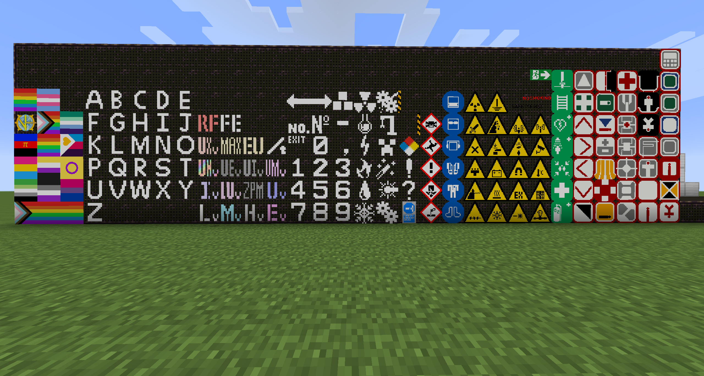

# Installation instructions
1. Make sure you have a chisel version compatible. If you have any GTNH version, you should be good.
2. Delete an existing Modern Markings mod if it exists.
3. Download the last version from the "Releases" tab on the right (Under `0.x.x-1.7.10-Jurre`, the mod should be called `modernmarkings-0.x.x-1.7.10-Jurre.jar`)
4. Put it in your mods folder
5. Launch the game

## F.A.Q.
Q. What does this have over the GTNH version of MM?
A. I have added pride flags and other extra markings, as well as backporting everything they add to this fork.

The total (hopefully up-to-date) list of flags this fork has is:

Q. Will it work with a chisel from non-GTNH?
A. Maybe? The dependencies file says "GTNH:Chisel:2.16.4-GTNH", but it might work in other 1.7.10 modpacks.

Q. I want to add more markings
A. Feel free to make a PR if you know how to implement them, or DM me the files (16x16-64x64 pngs) on discord (@jurrejelle).

Q. I have a question
A. Feel free to either open an issue, or DM me on discord (@jurrejelle).

## Info
A fork of the 1.7.10 backport of the 1.12.2 backport for the very simple mod that adds various decorational markings.

the 1.20.1 version -> https://github.com/Aminoglycoside148/modernmarkings_1.20.x
the 1.12.2 version -> https://github.com/Aminoglycoside148/ModernMarkings_1.12.2_Rewrite_3

Based on https://github.com/GTNewHorizons/ModernMarkings
